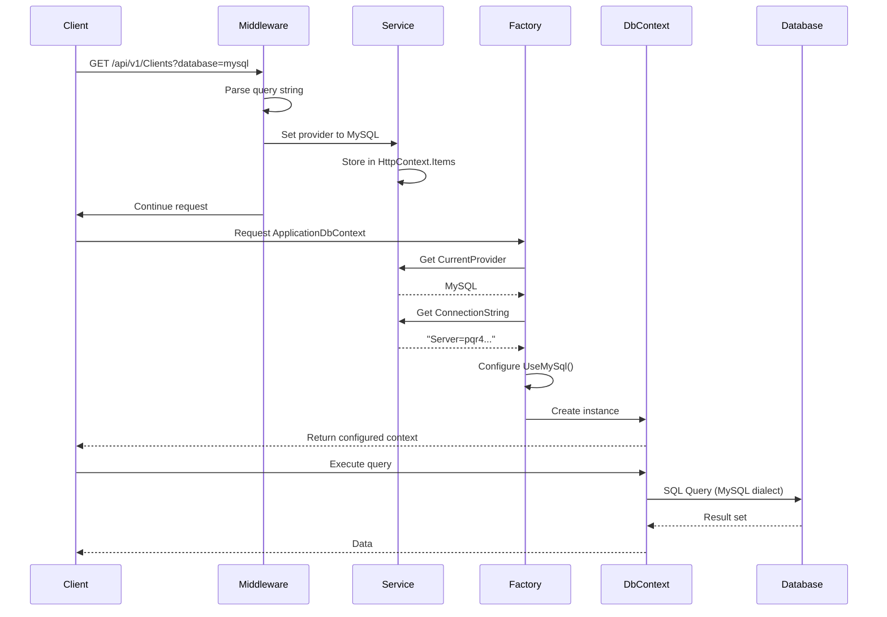

# 🗄️ Sistema Multi-Base de Datos - Implementación Completa

## 📋 Tabla de Contenidos

1. [Introducción](#introducción)
2. [Arquitectura del Sistema](#arquitectura-del-sistema)
3. [Proveedores Soportados](#proveedores-soportados)
4. [Componentes Principales](#componentes-principales)
5. [Flujo de Funcionamiento](#flujo-de-funcionamiento)
6. [Configuración](#configuración)
7. [Uso de la API](#uso-de-la-api)
8. [Health Checks](#health-checks)
9. [Implementación Paso a Paso](#implementación-paso-a-paso)
10. [Solución de Problemas](#solución-de-problemas)

---

## 📖 Introducción

Este sistema permite que la API de ElectroHuila funcione con **múltiples proveedores de bases de datos** de forma dinámica, sin necesidad de recompilar o reiniciar la aplicación. Los usuarios pueden cambiar entre Oracle, SQL Server, PostgreSQL y MySQL usando un simple parámetro en la URL.

### ✨ Características Principales

- **Selección Dinámica**: Cambia de base de datos por request HTTP
- **4 Proveedores**: Oracle, SQL Server, PostgreSQL y MySQL
- **Health Checks**: Endpoints para verificar conectividad
- **Factory Pattern**: Creación dinámica de DbContext
- **Configuración Flexible**: Variables de entorno y appsettings.json

---

## 🏗️ Arquitectura del Sistema

```
┌─────────────────────────────────────────────────────────────┐
│                      HTTP Request                           │
│              ?database=mysql                                │
└──────────────────────────┬──────────────────────────────────┘
                           │
                           ▼
┌─────────────────────────────────────────────────────────────┐
│              DatabaseProviderMiddleware                     │
│  - Captura el parámetro 'database' del query string        │
│  - Almacena el proveedor en HttpContext.Items               │
└──────────────────────────┬──────────────────────────────────┘
                           │
                           ▼
┌─────────────────────────────────────────────────────────────┐
│              DatabaseProviderService                        │
│  - Lee el proveedor desde HttpContext.Items                 │
│  - Retorna la cadena de conexión correspondiente            │
└──────────────────────────┬──────────────────────────────────┘
                           │
                           ▼
┌─────────────────────────────────────────────────────────────┐
│           ApplicationDbContextFactory                       │
│  - Crea DbContext con el proveedor correcto                 │
│  - Configura UseOracle / UseSqlServer / UseNpgsql / UseMySql│
└──────────────────────────┬──────────────────────────────────┘
                           │
                           ▼
┌─────────────────────────────────────────────────────────────┐
│               ApplicationDbContext                          │
│  - Ejecuta queries contra la base de datos seleccionada     │
└─────────────────────────────────────────────────────────────┘
```

---

## 🎯 Proveedores Soportados

| Proveedor   | Parámetro URL  | NuGet Package                              | Versión |
|-------------|----------------|-----------------------------------------------|---------|
| **Oracle**  | `?database=oracle` | `Oracle.EntityFrameworkCore`             | Latest  |
| **SQL Server** | `?database=sqlserver` | `Microsoft.EntityFrameworkCore.SqlServer` | Latest  |
| **PostgreSQL** | `?database=postgresql` | `Npgsql.EntityFrameworkCore.PostgreSQL` | Latest  |
| **MySQL**   | `?database=mysql` | `Pomelo.EntityFrameworkCore.MySql`        | 9.0.0   |

### 🔌 Conexiones AWS RDS Configuradas

```
Oracle:     pqragendamientocitas.cfim4cuiqpgk.us-east-2.rds.amazonaws.com:1521/PQR
SQL Server: pqr3.cfim4cuiqpgk.us-east-2.rds.amazonaws.com (Database: master)
PostgreSQL: pqr2.cfim4cuiqpgk.us-east-2.rds.amazonaws.com (Database: PQR2)
MySQL:      pqr4.cfim4cuiqpgk.us-east-2.rds.amazonaws.com (Database: PQR4)
```

---

## 🧩 Componentes Principales

### 1. **DatabaseProvider Enum**

Define los proveedores disponibles:

```csharp
public enum DatabaseProvider
{
    Oracle,
    SqlServer,
    PostgreSQL,
    MySQL
}
```

**Ubicación**: `src/2. Infrastructure/ElectroHuila.Infrastructure/Services/DatabaseProviderService.cs`

---

### 2. **DatabaseProviderService**

Gestiona el proveedor actual y las cadenas de conexión:

```csharp
public interface IDatabaseProviderService
{
    DatabaseProvider CurrentProvider { get; }
    string GetConnectionString();
    void SetProvider(DatabaseProvider provider);
}
```

**Responsabilidades**:
- ✅ Leer el proveedor desde `HttpContext.Items`
- ✅ Retornar la cadena de conexión correspondiente
- ✅ Permitir cambio manual del proveedor

**Flujo de Decisión**:

```
1. ¿Hay un override en memoria? → Usar ese
2. ¿Hay un proveedor en HttpContext.Items? → Usar ese
3. ¿Hay configuración en appsettings? → Usar ese
4. Default → Oracle
```

---

### 3. **DatabaseProviderMiddleware**

Middleware que captura el parámetro `database` del query string:

```csharp
public async Task InvokeAsync(HttpContext context, IDatabaseProviderService databaseProviderService)
{
    // Capturar el parámetro 'database' del query string
    if (context.Request.Query.TryGetValue("database", out var databaseValue))
    {
        var providerString = databaseValue.ToString();
        var provider = ParseProvider(providerString);
        
        if (provider.HasValue)
        {
            // Almacenar en HttpContext.Items para este request
            context.Items["DatabaseProvider"] = provider.Value.ToString();
            Console.WriteLine($"[Middleware] Database provider set to: {provider.Value}");
        }
    }
    
    await _next(context);
}
```

**Ubicación**: `src/2. Infrastructure/ElectroHuila.Infrastructure/Middleware/DatabaseProviderMiddleware.cs`

---

### 4. **ApplicationDbContextFactory**

Factory Pattern que crea instancias de `ApplicationDbContext` con el proveedor correcto:

```csharp
public class ApplicationDbContextFactory : IDbContextFactory
{
    public ApplicationDbContext CreateDbContext()
    {
        var provider = _databaseProviderService.CurrentProvider;
        var connectionString = _databaseProviderService.GetConnectionString();
        var optionsBuilder = new DbContextOptionsBuilder<ApplicationDbContext>();

        switch (provider)
        {
            case DatabaseProvider.Oracle:
                optionsBuilder.UseOracle(connectionString);
                break;
            case DatabaseProvider.SqlServer:
                optionsBuilder.UseSqlServer(connectionString);
                break;
            case DatabaseProvider.PostgreSQL:
                optionsBuilder.UseNpgsql(connectionString);
                break;
            case DatabaseProvider.MySQL:
                var serverVersion = new MySqlServerVersion(new Version(8, 0, 35));
                optionsBuilder.UseMySql(connectionString, serverVersion);
                break;
        }

        return new ApplicationDbContext(optionsBuilder.Options);
    }
}
```

**Ubicación**: `src/2. Infrastructure/ElectroHuila.Infrastructure/Persistence/ApplicationDbContextFactory.cs`

**Nota Importante**: Para MySQL usamos una versión fija (8.0.35) en lugar de `ServerVersion.AutoDetect()` para evitar problemas de conectividad durante la inicialización.

---

### 5. **DatabaseHealthController**

Controlador con endpoints para verificar la salud y conectividad de las bases de datos:

```csharp
[ApiController]
[Route("api/v1/[controller]")]
public class DatabaseHealthController : ControllerBase
{
    // GET /api/v1/DatabaseHealth/check?database=mysql
    [HttpGet("check")]
    public async Task<IActionResult> CheckDatabaseHealth()
    
    // GET /api/v1/DatabaseHealth/info
    [HttpGet("info")]
    public IActionResult GetDatabaseInfo()
    
    // GET /api/v1/DatabaseHealth/test-all
    [HttpGet("test-all")]
    public async Task<IActionResult> TestAllProviders()
}
```

**Ubicación**: `src/3. Presentation/ElectroHuila.WebApi/Controllers/V1/DatabaseHealthController.cs`

---

## 🔄 Flujo de Funcionamiento

### Escenario: Usuario hace una petición con `?database=mysql`

```
1️⃣ HTTP Request
   GET /api/v1/Clients?database=mysql

2️⃣ DatabaseProviderMiddleware
   - Detecta 'database=mysql' en query string
   - Parsea "mysql" → DatabaseProvider.MySQL
   - Almacena en HttpContext.Items["DatabaseProvider"] = "MySQL"

3️⃣ ClientsController ejecuta el método GetClients()
   - Inyecta IClientRepository
   - Repository necesita ApplicationDbContext

4️⃣ ApplicationDbContext se crea vía Factory
   - Se solicita IDbContextFactory del DI container
   - Factory llama a _databaseProviderService.CurrentProvider
   
5️⃣ DatabaseProviderService.CurrentProvider
   - Lee HttpContext.Items["DatabaseProvider"]
   - Retorna DatabaseProvider.MySQL

6️⃣ DatabaseProviderService.GetConnectionString()
   - Lee configuration.GetConnectionString("MySqlConnection")
   - Retorna "Server=pqr4.cfim4cuiqpgk.us-east-2.rds.amazonaws.com;..."

7️⃣ ApplicationDbContextFactory.CreateDbContext()
   - Ejecuta: optionsBuilder.UseMySql(connectionString, serverVersion)
   - Crea nuevo ApplicationDbContext con opciones de MySQL

8️⃣ Repository ejecuta query
   - context.Clients.ToListAsync()
   - Entity Framework genera SQL para MySQL
   - Query se ejecuta contra MySQL en AWS RDS

9️⃣ Respuesta HTTP
   - Datos retornados desde MySQL
```

---

## ⚙️ Configuración

### 1. **appsettings.json**

```json
{
  "DatabaseProvider": "Oracle",
  "ConnectionStrings": {
    "OracleConnection": "User Id=admin;Password=Superman5564;Data Source=pqragendamientocitas.cfim4cuiqpgk.us-east-2.rds.amazonaws.com:1521/PQR;",
    "SqlServerConnection": "Server=pqr3.cfim4cuiqpgk.us-east-2.rds.amazonaws.com;Database=master;User Id=admin;Password=Superman5564;TrustServerCertificate=True;Encrypt=False;",
    "PostgreSqlConnection": "Host=pqr2.cfim4cuiqpgk.us-east-2.rds.amazonaws.com;Database=PQR2;Username=postgres;Password=Superman5564;",
    "MySqlConnection": "Server=pqr4.cfim4cuiqpgk.us-east-2.rds.amazonaws.com;Database=PQR4;User=admin;Password=Superman5564;SslMode=None;"
  }
}
```

### 2. **Variables de Entorno (.env)**

```bash
# Proveedor por defecto
DATABASE_PROVIDER=Oracle

# Cadenas de conexión
ORACLE_CONNECTION_STRING=User Id=admin;Password=Superman5564;Data Source=pqragendamientocitas.cfim4cuiqpgk.us-east-2.rds.amazonaws.com:1521/PQR;Connection Timeout=60;
SQLSERVER_CONNECTION_STRING=Server=pqr3.cfim4cuiqpgk.us-east-2.rds.amazonaws.com;Database=master;User Id=admin;Password=Superman5564;TrustServerCertificate=True;Encrypt=False;
POSTGRESQL_CONNECTION_STRING=Host=pqr2.cfim4cuiqpgk.us-east-2.rds.amazonaws.com;Database=PQR2;Username=postgres;Password=Superman5564;
MYSQL_CONNECTION_STRING=Server=pqr4.cfim4cuiqpgk.us-east-2.rds.amazonaws.com;Database=PQR4;User=admin;Password=Superman5564;SslMode=None;
```

### 3. **Registro en Program.cs**

```csharp
// Registrar el servicio de proveedor de base de datos
services.AddScoped<IDatabaseProviderService, DatabaseProviderService>();

// Registrar el factory de DbContext
services.AddScoped<IDbContextFactory, ApplicationDbContextFactory>();

// Registrar el DbContext usando el factory
services.AddScoped<ApplicationDbContext>(serviceProvider =>
{
    var factory = serviceProvider.GetRequiredService<IDbContextFactory>();
    return factory.CreateDbContext();
});

// Registrar el middleware
app.UseDatabaseProviderSelector();
```

---

## 🚀 Uso de la API

### Cambiar de Base de Datos por Request

Simplemente agrega el parámetro `?database=` a cualquier endpoint:

```bash
# Usar Oracle (por defecto)
GET /api/v1/Clients

# Usar SQL Server
GET /api/v1/Clients?database=sqlserver

# Usar PostgreSQL
GET /api/v1/Clients?database=postgresql

# Usar MySQL
GET /api/v1/Clients?database=mysql
```

### Ejemplos con cURL

```bash
# Oracle
curl -X GET "http://localhost:5000/api/v1/Clients?database=oracle"

# SQL Server
curl -X GET "http://localhost:5000/api/v1/Clients?database=sqlserver"

# PostgreSQL
curl -X GET "http://localhost:5000/api/v1/Clients?database=postgresql"

# MySQL
curl -X GET "http://localhost:5000/api/v1/Clients?database=mysql"
```

### Ejemplos con JavaScript/Fetch

```javascript
// Oracle
fetch('/api/v1/Clients?database=oracle')
  .then(res => res.json())
  .then(data => console.log(data));

// MySQL
fetch('/api/v1/Clients?database=mysql')
  .then(res => res.json())
  .then(data => console.log(data));
```

---

## 🏥 Health Checks

### 1. **Verificar Base de Datos Actual**

```bash
GET /api/v1/DatabaseHealth/check?database=mysql
```

**Respuesta**:
```json
{
  "provider": "MySQL",
  "isConnected": true,
  "message": "Successfully connected to MySQL database",
  "databaseName": "PQR4",
  "connectionStringPreview": "Server=pqr4.cfim4cuiqpgk.us-east-2.rds.amazonaws.com;Database=PQR4;User=***;Password=***;SslMode=None;",
  "timestamp": "2025-10-20T15:30:00Z"
}
```

### 2. **Obtener Información del Proveedor**

```bash
GET /api/v1/DatabaseHealth/info
```

**Respuesta**:
```json
{
  "currentProvider": "Oracle",
  "connectionStringPreview": "User Id=***;Password=***;Data Source=pqragendamientocitas.cfim4cuiqpgk.us-east-2.rds.amazonaws.com:1521/PQR;",
  "availableProviders": ["Oracle", "SqlServer", "PostgreSQL", "MySQL"],
  "message": "Currently configured to use Oracle database"
}
```

### 3. **Probar Todos los Proveedores**

```bash
GET /api/v1/DatabaseHealth/test-all
```

**Respuesta**:
```json
{
  "results": [
    {
      "provider": "Oracle",
      "isConfigured": true,
      "isConnected": true,
      "message": "Connection successful",
      "connectionStringPreview": "User Id=***;Password=***;Data Source=pqragendamientocitas.cfim4cuiqpgk.us-east-2.rds.amazonaws.com:1521/PQR;"
    },
    {
      "provider": "SqlServer",
      "isConfigured": true,
      "isConnected": true,
      "message": "Connection successful",
      "connectionStringPreview": "Server=pqr3.cfim4cuiqpgk.us-east-2.rds.amazonaws.com;Database=master;User Id=***;Password=***;"
    },
    {
      "provider": "PostgreSQL",
      "isConfigured": true,
      "isConnected": true,
      "message": "Connection successful",
      "connectionStringPreview": "Host=pqr2.cfim4cuiqpgk.us-east-2.rds.amazonaws.com;Database=PQR2;Username=***;Password=***;"
    },
    {
      "provider": "MySQL",
      "isConfigured": true,
      "isConnected": true,
      "message": "Connection successful",
      "connectionStringPreview": "Server=pqr4.cfim4cuiqpgk.us-east-2.rds.amazonaws.com;Database=PQR4;User=***;Password=***;"
    }
  ],
  "testedAt": "2025-10-20T15:31:38Z"
}
```

---

## 🛠️ Implementación Paso a Paso

### Paso 1: Instalar Paquetes NuGet

```bash
# Oracle
dotnet add package Oracle.EntityFrameworkCore

# SQL Server
dotnet add package Microsoft.EntityFrameworkCore.SqlServer

# PostgreSQL
dotnet add package Npgsql.EntityFrameworkCore.PostgreSQL

# MySQL
dotnet add package Pomelo.EntityFrameworkCore.MySql
```

### Paso 2: Crear el Enum DatabaseProvider

```csharp
public enum DatabaseProvider
{
    Oracle,
    SqlServer,
    PostgreSQL,
    MySQL
}
```

### Paso 3: Implementar IDatabaseProviderService

```csharp
public interface IDatabaseProviderService
{
    DatabaseProvider CurrentProvider { get; }
    string GetConnectionString();
    void SetProvider(DatabaseProvider provider);
}

public class DatabaseProviderService : IDatabaseProviderService
{
    private readonly IConfiguration _configuration;
    private readonly IHttpContextAccessor _httpContextAccessor;

    public DatabaseProvider CurrentProvider
    {
        get
        {
            // Leer desde HttpContext.Items
            var httpContext = _httpContextAccessor.HttpContext;
            if (httpContext?.Items.ContainsKey("DatabaseProvider") == true)
            {
                var providerString = httpContext.Items["DatabaseProvider"]?.ToString();
                var parsed = ParseProvider(providerString);
                if (parsed.HasValue) return parsed.Value;
            }
            
            // Fallback a configuración
            var defaultProvider = _configuration["DatabaseProvider"] ?? "Oracle";
            return ParseProvider(defaultProvider) ?? DatabaseProvider.Oracle;
        }
    }

    public string GetConnectionString()
    {
        return CurrentProvider switch
        {
            DatabaseProvider.Oracle => _configuration.GetConnectionString("OracleConnection"),
            DatabaseProvider.SqlServer => _configuration.GetConnectionString("SqlServerConnection"),
            DatabaseProvider.PostgreSQL => _configuration.GetConnectionString("PostgreSqlConnection"),
            DatabaseProvider.MySQL => _configuration.GetConnectionString("MySqlConnection"),
            _ => throw new InvalidOperationException($"Unsupported provider: {CurrentProvider}")
        };
    }

    private static DatabaseProvider? ParseProvider(string providerString)
    {
        return providerString?.ToUpperInvariant() switch
        {
            "ORACLE" => DatabaseProvider.Oracle,
            "SQLSERVER" => DatabaseProvider.SqlServer,
            "POSTGRESQL" => DatabaseProvider.PostgreSQL,
            "MYSQL" => DatabaseProvider.MySQL,
            _ => null
        };
    }
}
```

### Paso 4: Crear el Middleware

```csharp
public class DatabaseProviderMiddleware
{
    private readonly RequestDelegate _next;

    public DatabaseProviderMiddleware(RequestDelegate next)
    {
        _next = next;
    }

    public async Task InvokeAsync(HttpContext context, IDatabaseProviderService databaseProviderService)
    {
        if (context.Request.Query.TryGetValue("database", out var databaseValue))
        {
            var providerString = databaseValue.ToString();
            var provider = ParseProvider(providerString);
            
            if (provider.HasValue)
            {
                context.Items["DatabaseProvider"] = provider.Value.ToString();
            }
        }
        
        await _next(context);
    }

    private static DatabaseProvider? ParseProvider(string providerString)
    {
        return providerString?.ToUpperInvariant() switch
        {
            "ORACLE" => DatabaseProvider.Oracle,
            "SQLSERVER" => DatabaseProvider.SqlServer,
            "POSTGRESQL" => DatabaseProvider.PostgreSQL,
            "MYSQL" => DatabaseProvider.MySQL,
            _ => null
        };
    }
}
```

### Paso 5: Crear el Factory

```csharp
public interface IDbContextFactory
{
    ApplicationDbContext CreateDbContext();
}

public class ApplicationDbContextFactory : IDbContextFactory
{
    private readonly IDatabaseProviderService _databaseProviderService;

    public ApplicationDbContextFactory(IDatabaseProviderService databaseProviderService)
    {
        _databaseProviderService = databaseProviderService;
    }

    public ApplicationDbContext CreateDbContext()
    {
        var provider = _databaseProviderService.CurrentProvider;
        var connectionString = _databaseProviderService.GetConnectionString();
        var optionsBuilder = new DbContextOptionsBuilder<ApplicationDbContext>();

        switch (provider)
        {
            case DatabaseProvider.Oracle:
                optionsBuilder.UseOracle(connectionString);
                break;
            case DatabaseProvider.SqlServer:
                optionsBuilder.UseSqlServer(connectionString);
                break;
            case DatabaseProvider.PostgreSQL:
                optionsBuilder.UseNpgsql(connectionString);
                break;
            case DatabaseProvider.MySQL:
                var serverVersion = new MySqlServerVersion(new Version(8, 0, 35));
                optionsBuilder.UseMySql(connectionString, serverVersion);
                break;
        }

        return new ApplicationDbContext(optionsBuilder.Options);
    }
}
```

### Paso 6: Registrar en DI Container

```csharp
// En DependencyInjection.cs
services.AddScoped<IDatabaseProviderService, DatabaseProviderService>();
services.AddScoped<IDbContextFactory, ApplicationDbContextFactory>();

services.AddScoped<ApplicationDbContext>(serviceProvider =>
{
    var factory = serviceProvider.GetRequiredService<IDbContextFactory>();
    return factory.CreateDbContext();
});
```

### Paso 7: Registrar Middleware

```csharp
// En Program.cs
app.UseDatabaseProviderSelector();
```

---

## 🐛 Solución de Problemas

### Problema 1: "No database provider has been configured"

**Causa**: El factory no está configurando correctamente el provider para MySQL.

**Solución**: Verificar que el case de MySQL esté presente:

```csharp
case DatabaseProvider.MySQL:
    var serverVersion = new MySqlServerVersion(new Version(8, 0, 35));
    optionsBuilder.UseMySql(connectionString, serverVersion);
    break;
```

### Problema 2: "ServerVersion.AutoDetect failed"

**Causa**: MySQL intenta autodetectar la versión y falla por problemas de red.

**Solución**: Usar una versión fija:

```csharp
// ❌ No usar esto
var serverVersion = ServerVersion.AutoDetect(connectionString);

// ✅ Usar esto
var serverVersion = new MySqlServerVersion(new Version(8, 0, 35));
```

### Problema 3: Cadena de conexión no encontrada

**Causa**: El nombre de la clave no coincide.

**Solución**: Verificar que los nombres coincidan:

```csharp
// En DatabaseProviderService
DatabaseProvider.MySQL => _configuration.GetConnectionString("MySqlConnection")

// En appsettings.json
"ConnectionStrings": {
  "MySqlConnection": "..."  // ← Mismo nombre
}
```

### Problema 4: Middleware no funciona

**Causa**: El middleware no está registrado correctamente.

**Solución**: Asegurar el orden correcto:

```csharp
app.UseDatabaseProviderSelector();  // ← Debe ir ANTES
app.UseAuthentication();
app.UseAuthorization();
app.MapControllers();
```

---

## 📊 Diagrama de Secuencia Completo



---

## 📝 Notas Finales

### Ventajas de Esta Implementación

✅ **Sin reinicio**: Cambio de BD sin reiniciar la aplicación
✅ **Flexible**: Agregar nuevos proveedores es sencillo
✅ **Testeable**: Fácil de probar con diferentes BDs
✅ **Scoped**: Cada request puede usar una BD diferente
✅ **Health Checks**: Monitoreo de conectividad incluido

### Limitaciones

⚠️ **Esquema único**: Todas las BDs deben tener el mismo esquema
⚠️ **Migraciones**: Se deben aplicar a todas las BDs
⚠️ **Dialecto SQL**: Entity Framework genera SQL específico para cada proveedor
⚠️ **Performance**: Crear DbContext por request tiene overhead

### Mejoras Futuras

- 🔄 Pool de conexiones por proveedor
- 📊 Métricas de uso por proveedor
- 🔐 Autenticación diferente por proveedor
- 🌐 Load balancing entre múltiples instancias
- 📦 Cache de DbContext options

---

## 🎓 Autor

**Diego Arias**  
ElectroHuila - Sistema de Agendamiento de Citas PQR  
Fecha: Octubre 2025

---

## 📚 Referencias

- [Entity Framework Core Providers](https://docs.microsoft.com/en-us/ef/core/providers/)
- [Pomelo MySQL Provider](https://github.com/PomeloFoundation/Pomelo.EntityFrameworkCore.MySql)
- [Factory Pattern in C#](https://refactoring.guru/design-patterns/factory-method/csharp)
- [ASP.NET Core Middleware](https://docs.microsoft.com/en-us/aspnet/core/fundamentals/middleware/)

